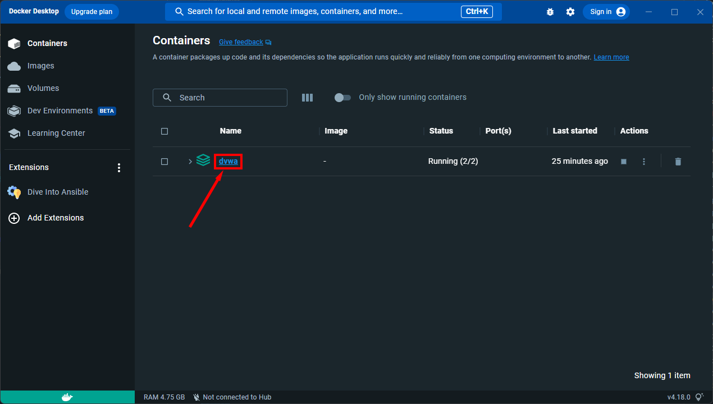
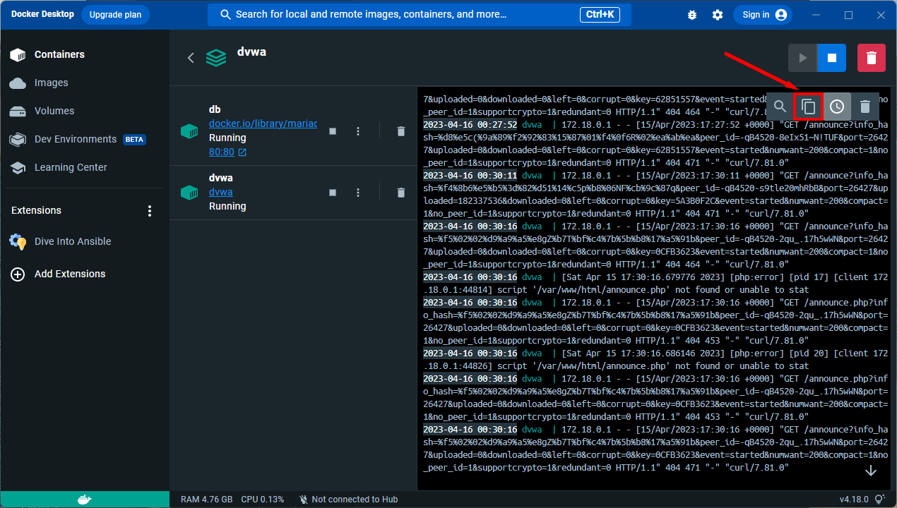

# DAMN VULNERABLE WEB APPLICATION

Damn Vulnerable Web Application (DVWA)은 매우 취약한 PHP/MySQL 웹 애플리케이션입니다. DVWA의 주요 목표는 보안 전문가들이 자신의 기술과 도구를 합법적인 환경에서 테스트하고, 웹 개발자들이 웹 애플리케이션 보안 프로세스를 더 잘 이해하도록 돕는 것입니다. 또한, 학생과 교사들이 통제된 교실 환경에서 웹 애플리케이션 보안에 대해 배우는 데 도움을 주고자 합니다.

DVWA의 목표는 **가장 흔한 웹 취약점들에 대한 연습**을 **다양한 난이도로 제공하는 것**입니다. 간단하고 직관적인 인터페이스를 갖추고 있습니다. 이 소프트웨어에는 **문서화된 취약점과 문서화되지 않은 취약점**이 모두 존재합니다. 이는 의도적인 것으로, 가능한 많은 문제를 발견해 보시기를 권장합니다.
- - -

## 주의!

Damn Vulnerable Web Application은 매우 취약합니다! **호스팅 제공자의 공개 html 폴더나 인터넷에 노출된 서버에 업로드하지 마십시오.** 그렇지 않으면 서버가 침해될 수 있습니다. 가상 머신(예: [VirtualBox](https://www.virtualbox.org/) or [VMware](https://www.vmware.com/))을 사용하고 NAT 네트워킹 모드로 설정하는 것이 좋습니다. 게스트 머신 내에서 [XAMPP](https://www.apachefriends.org/)를 다운로드하여 웹 서버와 데이터베이스를 설치할 수 있습니다.

### 면책 조항

우리는 DVWA의 사용 방식에 대해 책임을 지지 않습니다. 애플리케이션의 목적은 명확히 설명되어 있으며, 악의적으로 사용해서는 안 됩니다. 사용자가 DVWA를 라이브 웹 서버에 설치하지 않도록 경고와 조치를 취했습니다. DVWA 설치를 통해 웹 서버가 침해된 경우, 이는 설치한 개인의 책임입니다.

- - -

## 라이선스

이 파일은 Damn Vulnerable Web Application (DVWA)의 일부입니다.

Damn Vulnerable Web Application (DVWA)은 자유 소프트웨어입니다: 귀하는 이를 재배포하거나 수정할 수 있으며, GNU 일반 공중 사용 허가서(GNU General Public License) 버전 3 또는 (옵션으로) 그 이후 버전의 조건에 따라 이를 사용할 수 있습니다.

Damn Vulnerable Web Application (DVWA)은 유용할 것이라는 희망으로 배포되지만, 어떠한 형태의 보증도 제공하지 않습니다. 상업성이나 특정 목적에의 적합성에 대한 묵시적인 보증도 포함되지 않습니다. 자세한 내용은 GNU 일반 공중 사용 허가서를 참조하십시오.

Damn Vulnerable Web Application (DVWA)와 함께 GNU 일반 공중 사용 허가서 사본을 받았어야 합니다. 그렇지 않다면 <https://www.gnu.org/licenses/>에서 확인하십시오.

- - -

## 국제화
이 파일은 여러 언어로 제공됩니다:
- 스페인어: [Espaol](README.es.md)
- 아랍어: [العربية](README.ar.md)
- 영어: [English](README.md)
- 인도네시아어: [Indonesia](README.id.md)
- 중국어: [简体中文](README.zh.md)
- 터키어: [Trke](README.tr.md)
- 페르시아어: [فارسی](README.fa.md)
- 포르투갈어: [Portugus](README.pt.md)
- 프랑스어: [Franais](README.fr.md)
- 한국어: [한국어](README.ko.md)

번역에 기여하고자 한다면 PR을 제출해 주십시오. 단, 구글 번역기를 사용한 번역은 거부됩니다. 번역본을 제출하려면, 번역된 'README.xx.md' 파일을 추가하십시오. 여기서 xx는 원하는 언어의 두 글자 코드([ISO 639-1](https://en.wikipedia.org/wiki/List_of_ISO_639-1_codes) 기반)입니다.

## 다운로드

DVWA에는 여러 가지 버전이 있지만, 유일하게 지원되는 버전은 공식 GitHub 저장소에서 제공하는 최신 소스입니다. 저장소에서 클론할 수 있습니다:

```
git clone https://github.com/digininja/DVWA.git
```

또는 [파일의 ZIP을 다운로드](https://github.com/digininja/DVWA/archive/master.zip)할 수 있습니다.

- - -

## 설치

### 자동 설치 🛠️

**참고: 이것은 공식 DVWA 스크립트가 아니며, [IamCarron](https://github.com/iamCarron/)에 의해 작성되었습니다. 스크립트를 작성하는 데 많은 노력이 들어갔으며, 작성 당시에는 악의적인 행동을 하지 않았지만, 시스템에서 무작정 실행하기 전에 스크립트를 검토하는 것이 좋습니다. 버그가 발견되면 이곳이 아닌 [IamCarron](https://github.com/iamCarron/)에게 보고해 주세요.**

Debian 기반 머신(Kali, Ubuntu, Kubuntu, Linux Mint, Zorin OS 등)에서 DVWA를 자동으로 구성하는 스크립트입니다.

**참고: 이 스크립트는 루트 권한이 필요하며 Debian 기반 시스템에 맞춰져 있습니다. 반드시 루트 사용자로 실행하세요.**

#### 설치 요구 사항

- **운영 체제:** Debian 기반 시스템 (Kali, Ubuntu, Kubuntu, Linux Mint, Zorin OS)
- **권한:** 루트 사용자로 실행

#### 설치 단계

1. **스크립트 다운로드:**
   ```bash
   wget https://raw.githubusercontent.com/IamCarron/DVWA-Script/main/Install-DVWA.sh
   ```

2. **스크립트 실행 권한 부여:**
   ```bash
   chmod +x Install-DVWA.sh
   ```

3. **루트로 스크립트 실행:**
   ```bash
   sudo ./Install-DVWA.sh
   ```

### 설치 동영상

- [VirtualBox에서 실행 중인 Kali에 DVWA 설치](https://www.youtube.com/watch?v=WkyDxNJkgQ4)
- [Windows에서 XAMPP를 사용하여 DVWA 설치](https://youtu.be/Yzksa_WjnY0)
- [Windows 10에 Damn Vulnerable Web Application (DVWA) 설치](https://www.youtube.com/watch?v=cak2lQvBRAo)

### Windows + XAMPP

가장 쉬운 DVWA 설치 방법은 [XAMPP](https://www.apachefriends.org/)를 다운로드하여 설치하는 것입니다. 이미 웹 서버가 설정되어 있지 않은 경우에 유용합니다.

XAMPP는 Linux, Solaris, Windows 및 Mac OS X용으로 설치하기 쉬운 Apache 배포판입니다. 이 패키지에는 Apache 웹 서버, MySQL, PHP, Perl, FTP 서버 및 phpMyAdmin이 포함되어 있습니다.

이 [비디오](https://youtu.be/Yzksa_WjnY0)는 Windows에 대한 설치 과정을 안내하지만, 다른 OS에서도 유사할 것입니다.

### Docker

[hoang-himself](https://github.com/hoang-himself)와 [JGillam](https://github.com/JGillam) 덕분에 `master` 브랜치에 대한 모든 커밋은 Docker 이미지를 빌드하고 GitHub Container Registry에서 내려받을 수 있게 합니다.

얻을 수 있는 것에 대한 자세한 내용은 [사전 빌드된 Docker 이미지](https://github.com/digininja/DVWA/pkgs/container/dvwa)를 참조하십시오.

#### 시작하기

선행 요건: Docker 및 Docker Compose.

- Docker Desktop을 사용하는 경우, 두 가지가 이미 설치되어 있어야 합니다.
- Linux에서 Docker Engine을 선호하는 경우, [설치 가이드](https://docs.docker.com/engine/install/#server)를 따라 설치하세요.

**위에서 언급한 최신 Docker 릴리스에 대한 지원을 제공합니다.**
Linux에서 패키지 관리자를 통해 제공된 Docker 패키지를 사용하는 경우에도 작동할 가능성이 있지만, 지원은 최선의 노력을 다합니다.

패키지 관리자 버전에서 업스트림으로 Docker를 업그레이드하려면 [Ubuntu](https://docs.docker.com/engine/install/ubuntu/#uninstall-old-versions), [Fedora](https://docs.docker.com/engine/install/fedora/#uninstall-old-versions) 등에서 설명하는 대로 이전 버전을 제거해야 합니다.
Docker 데이터(컨테이너, 이미지, 볼륨 등)는 영향을 받지 않아야 하지만 문제가 발생하면 [Docker에 알리고](https://www.docker.com/support) 검색 엔진을 사용하는 것이 좋습니다.

그런 다음 시작하려면:

1. `docker version` 및 `docker compose version`을 실행하여 Docker 및 Docker Compose가 제대로 설치되었는지 확인하세요. 출력에서 해당 버전을 확인할 수 있어야 합니다.

    예를 들어:

    ```text
    >>> docker version
    Client:
     [...]
     Version:           23.0.5
     [...]

    Server: Docker Desktop 4.19.0 (106363)
     Engine:
      [...]
      Version:          23.0.5
      [...]

    >>> docker compose version
    Docker Compose version v2.17.3
    ```

    아무것도 표시되지 않거나 명령어를 찾을 수 없다는 오류가 발생하면 Docker 및 Docker Compose를 설정하기 위한 필수 조건을 따르세요.

2. 이 리포지토리를 클론하거나 다운로드하여 압축을 풉니다 (참조 [다운로드](#download)).
3. 선택한 터미널을 열고 작업 디렉터리를 이 폴더(`DVWA`)로 변경합니다.
4. `docker compose up -d`를 실행합니다.

이제 DVWA는 `http://localhost:4280`에서 사용할 수 있습니다.

**컨테이너에서 DVWA를 실행할 때, 웹 서버는 일반적인 포트 80 대신 포트 4280에서 수신 대기하고 있습니다.**
이 결정에 대한 자세한 내용은 [다른 포트에서 DVWA를 실행하고 싶습니다](#i-want-to-run-dvwa-on-a-different-port)를 참조하세요.

#### 로컬 빌드

로컬에서 변경 사항을 적용하고 프로젝트를 빌드하려면 `compose.yml` 파일에서 `pull_policy: always`를 `pull_policy: build`로 변경하십시오.

`docker compose up -d`를 실행하면 레지스트리에 무엇이 있든 상관없이 Docker가 로컬에서 이미지를 빌드하도록 트리거됩니다.

참조: [`pull_policy`](https://github.com/compose-spec/compose-spec/blob/master/05-services.md#pull_policy).

### PHP 버전

이상적으로는 최신 안정 버전의 PHP를 사용하는 것이 좋습니다. 이는 이 앱이 개발 및 테스트되는 버전입니다.

PHP 5.x를 사용하려는 사람에게는 지원이 제공되지 않습니다.

7.3 미만의 버전은 문제가 발생할 수 있는 알려진 이슈가 있으며, 대부분의 앱은 작동하겠지만 무작위로 문제가 발생할 수 있습니다. 아주 좋은 이유가 없는 한, 그렇게 오래된 버전을 사용하는 경우 지원이 제공되지 않습니다.

### Linux 패키지

Debian 기반 Linux 배포판을 사용하는 경우, 다음 패키지 _(또는 이에 상응하는 것)_ 를 설치해야 합니다:

- apache2
- libapache2-mod-php
- mariadb-server
- mariadb-client
- php
- php-mysqli
- php-gd

모든 최신 버전을 받기 위해 설치 전에 업데이트를 수행하는 것이 좋습니다.

```
apt update
apt install -y apache2 mariadb-server mariadb-client php php-mysqli php-gd libapache2-mod-php
```

이 사이트는 MariaDB 대신 MySQL로도 작동하지만, MySQL을 올바르게 작동시키기 위해 변경해야 하는 반면, MariaDB는 별다른 설정 없이 바로 작동하므로 MariaDB를 강력히 추천합니다.

## 구성

### 설정 파일

DVWA에는 해당 위치에 복사한 다음 적절한 변경 사항을 가할 필요가 있는 설정 파일의 더미 복사본이 함께 제공됩니다. 리눅스에서는 DVWA 디렉토리에 있는 것으로 가정하면 다음과 같이 수행할 수 있습니다:

`cp config/config.inc.php.dist config/config.inc.php`

Windows에서는 파일 확장자를 숨기는 경우 조금 더 어려울 수 있습니다. 이에 대해 자세히 알아보려면 다음 블로그 포스트를 참조하세요:

[Windows에서 파일 확장자 표시하는 방법](https://www.howtogeek.com/205086/beginner-how-to-make-windows-show-file-extensions/)

### 데이터베이스 설정

데이터베이스를 설정하려면, 단순히 주 메뉴의 `Setup DVWA` 버튼을 클릭한 다음 `Create / Reset Database` 버튼을 클릭하면 됩니다. 이렇게 하면 데이터베이스가 생성되거나 재설정되며 일부 데이터가 포함됩니다.

데이터베이스를 생성하는 동안 오류가 발생하면 `./config/config.inc.php` 내의 데이터베이스 자격 증명이 올바른지 확인하십시오. *이는 예제 파일인 config.inc.php.dist와 다릅니다.*

변수는 다음과 같이 기본값으로 설정됩니다:

```php
$_DVWA[ 'db_server'] = '127.0.0.1';
$_DVWA[ 'db_port'] = '3306';
$_DVWA[ 'db_user' ] = 'dvwa';
$_DVWA[ 'db_password' ] = 'p@ssw0rd';
$_DVWA[ 'db_database' ] = 'dvwa';
```

참고로, MySQL 대신 MariaDB를 사용하는 경우 (Kali의 기본값은 MariaDB입니다), 데이터베이스 루트 사용자를 사용할 수 없으므로 새 데이터베이스 사용자를 생성해야 합니다. 이를 위해 루트 사용자로 데이터베이스에 연결한 다음 다음 명령을 사용하십시오:

```mysql
mysql> create database dvwa;
Query OK, 1 row affected (0.00 sec)

mysql> create user dvwa@localhost identified by 'p@ssw0rd';
Query OK, 0 rows affected (0.01 sec)

mysql> grant all on dvwa.* to dvwa@localhost;
Query OK, 0 rows affected (0.01 sec)

mysql> flush privileges;
Query OK, 0 rows affected (0.00 sec)
```

### 인증 비활성화

일부 도구는 인증을 사용할 수 없으므로 DVWA와 함께 사용할 수 없습니다. 이를 해결하기 위해 인증 확인을 비활성화하는 구성 옵션이 있습니다. 이를 위해 설정 파일에서 다음을 설정하면 됩니다:

```php
$_DVWA[ 'disable_authentication' ] = true;
```

또한 테스트하려는 내용에 적합한 보안 수준으로 보안 수준을 설정해야 합니다:

```php
$_DVWA[ 'default_security_level' ] = 'low';
```

이 상태에서는 로그인할 필요 없이 모든 기능에 액세스할 수 있습니다.

### 폴더 권한

* `./hackable/uploads/` - 웹 서비스에 의해 쓰기 가능해야 합니다 (파일 업로드를 위해).

### PHP 구성

리눅스 시스템에서는 일반적으로 `/etc/php/x.x/fpm/php.ini` 또는 `/etc/php/x.x/apache2/php.ini`에서 찾을 수 있습니다.

* 원격 파일 포함 (RFI)을 허용하려면:
    * `allow_url_include = on` [[allow_url_include](https://secure.php.net/manual/en/filesystem.configuration.php#ini.allow-url-include)]
    * `allow_url_fopen = on` [[allow_url_fopen](https://secure.php.net/manual/en/filesystem.configuration.php#ini.allow-url-fopen)]

* PHP가 모든 오류 메시지를 표시하도록 하려면:
    * `display_errors = on` [[display_errors](https://secure.php.net/manual/en/errorfunc.configuration.php#ini.display-errors)]
    * `display_startup_errors = on` [[display_startup_errors](https://secure.php.net/manual/en/errorfunc.configuration.php#ini.display-startup-errors)]

변경 사항을 적용한 후 php 서비스 또는 Apache를 다시 시작하는지 확인하세요.

### reCAPTCHA

이는 "Insecure CAPTCHA" 랩에서만 필요하며 해당 랩을 사용하지 않는다면 이 섹션을 무시할 수 있습니다.

<https://www.google.com/recaptcha/admin/create>에서 API 키 쌍을 생성합니다.

그런 다음 이 키는 `./config/config.inc.php`의 다음 섹션에 들어갑니다:

* `$_DVWA[ 'recaptcha_public_key' ]`
* `$_DVWA[ 'recaptcha_private_key' ]`

### 기본 자격 증명

**기본 사용자 이름 = `admin`**

**기본 암호 = `password`**

_... 쉽게 브루트 포스될 수 있음 ;)_

로그인 URL: http://127.0.0.1/login.php

_참고: DVWA를 다른 디렉토리에 설치한 경우 이 URL이 다를 수 있습니다._


- - -

## 문제 해결

이 문제 해결 방법은 Debian 기반 배포판인 Debian, Ubuntu 및 Kali를 사용한다고 가정합니다. 다른 배포판의 경우 해당 명령을 업데이트하여 따르세요.

### 컨테이너

#### 로그에 접근하고 싶어요

Docker Desktop을 사용하는 경우 로그는 그래픽 애플리케이션에서 접근할 수 있습니다.
새로운 버전에서 약간의 세부 사항이 변경될 수 있지만 접근 방법은 동일해야 합니다.




로그는 터미널에서도 확인할 수 있습니다.

1. 터미널을 열고 작업 디렉토리를 DVWA로 변경하세요.
2. 병합된 로그 표시

    ```shell
    docker compose logs
    ```

   로그를 파일로 내보내려는 경우, 예를 들어 `dvwa.log`

   ```shell
   docker compose logs >dvwa.log
   ```

#### 다른 포트에서 DVWA 실행하고 싶어요

기본적으로 포트 80을 사용하지 않는 이유는 몇 가지 있습니다.

- 일부 사용자는 이미 포트 80에서 무언가를 실행 중일 수 있습니다.
- 일부 사용자는 루트리스 컨테이너 엔진(예: Podman)을 사용할 수 있으며 80은 특권 포트(< 1024)입니다. 추가 구성(예: `net.ipv4.ip_unprivileged_port_start` 설정)이 필요하지만 직접 조사해야 합니다.

`compose.yml` 파일에서 포트 바인딩을 변경하여 DVWA를 다른 포트에서 노출할 수 있습니다.
예를 들어,

```yml
ports:
  - 127.0.0.1:4280:80
```

를

```yml
ports:
  - 127.0.0.1:8806:80
```

로 변경할 수 있습니다.

DVWA는 이제 `http://localhost:8806`에서 접근할 수 있습니다.

디바이스에서만 독점적으로 DVWA에 액세스하고 싶을 때가 있습니다(예: 워크샵을 위한 테스트 머신을 설정하는 경우), 로컬 네트워크에서도 액세스할 수 있도록 하려면 포트 매핑에서 `127.0.0.1:`을 제거하거나(또는 LAN IP로 대체)하세요. 이렇게 하면 모든 사용 가능한 디바이스에서 수신됩니다. 안전한 기본 설정은 항상 로컬 루프백 디바이스에서만 수신하는 것입니다. 결국, 이것은 사용자의 머신에서 실행되는 위험한 웹 응용 프로그램입니다.

#### Docker 실행 시 DVWA 자동 시작

포함된 [`compose.yml`](./compose.yml) 파일은 Docker가 시작될 때 자동으로 DVWA와 해당 데이터베이스를 실행합니다.

이 기능을 비활성화하려면 [`compose.yml`](./compose.yml) 파일에서 `restart: unless-stopped` 라인을 삭제하거나 주석 처리하세요.

이 동작을 일시적으로 비활성화하려면 `docker compose stop`을 실행하거나 Docker Desktop을 사용하여 `dvwa`를 찾아 중지를 클릭하세요.
또는 컨테이너를 삭제하거나 `docker compose down`을 실행할 수 있습니다.

### 로그 파일

리눅스 시스템에서는 Apache가 기본적으로 두 가지 로그 파일을 생성합니다. `access.log`와 `error.log`로, 데비안 기반 시스템에서는 보통 `/var/log/apache2/`에 있습니다.

에러 보고서, 문제 등을 제출할 때, 적어도 각각의 파일의 마지막 다섯 줄을 포함해야 합니다. 데비안 기반 시스템에서는 다음과 같이 가져올 수 있습니다.

```
tail -n 5 /var/log/apache2/access.log /var/log/apache2/error.log
```

### 사이트에 접속하여 404 오류가 발생했습니다

이 문제가 발생하면 파일 위치를 이해해야 합니다. 기본적으로 Apache 문서 루트(웹 콘텐츠를 찾는 곳)는 `/var/www/html`입니다. 이 디렉토리에 파일 `hello.txt`을 넣은 경우에는 `http://localhost/hello.txt`로 접속해야 합니다.

디렉토리를 만들고 파일을 넣은 경우 - `/var/www/html/mydir/hello.txt` - 그러면 `http://localhost/mydir/hello.txt`로 접속해야 합니다.

리눅스는 기본적으로 대소문자를 구분하므로 위의 예에서는 다음에 대한 `404 Not Found`가 발생합니다.

- `http://localhost/MyDir/hello.txt`
- `http://localhost/mydir/Hello.txt`
- `http://localhost/MYDIR/hello.txt`

이것이 DVWA에 어떻게 영향을 미치는가요? 대부분의 사람들은 DVWA를 `/var/www/html`에 체크아웃하기 때문에 모든 DVWA 파일이 들어 있는 `/var/www/html/DVWA/` 디렉토리가 생깁니다. 그런 다음 `http://localhost/`로 접속하면 `404` 또는 기본 Apache 환영 페이지를 받게 됩니다. 파일이 DVWA에 있으므로 `http://localhost/DVWA`로 접속해야 합니다.

다른 흔한 실수는 `http://localhost/dvwa`로 접속하는 것입니다. 이는 리눅스 디렉토리 매칭에 따라 `dvwa`가 `DVWA`가 아니기 때문에 `404`가 발생합니다.

따라서 설치 후에 사이트에 접속하여 `404`를 받는 경우, 파일을 어디에 설치했는지, 문서 루트와의 관계는 무엇인지, 사용한 디렉토리의 경우를 고려하세요.

### 설정 실행 중 "Access denied" 오류가 발생했습니다

설치 스크립트를 실행하는 도중 다음을 보게 되면, 설정 파일의 사용자 이름 또는 비밀번호가 데이터베이스에 구성된 것과 일치하지 않는다는 것입니다.

```
Database Error #1045: Access denied for user 'notdvwa'@'localhost' (using password: YES).
```

이 오류는 사용자 이름이 `notdvwa`임을 알려줍니다.

다음 오류는 설정 파일을 잘못된 데이터베이스에 연결한 것입니다.

```
SQL: Access denied for user 'dvwa'@'localhost' to database 'notdvwa'
```

이것은 사용자가 `dvwa` 사용자를 사용하고 `notdvwa` 데이터베이스에 연결하려고 시도했다고 말하고 있습니다.

첫 번째 할 일은 설정 파일에 입력한 것이 실제로 있는지 확인하는 것입니다.

예상한 대로 맞는다면, 다음으로 할 일은 명령 줄에서 사용자로 로그인할 수 있는지 확인하는 것입니다. 데이터베이스 사용자가 `dvwa`이고 암호가 `p@ssw0rd`인 경우 다음 명령을 실행하세요.

```
mysql -u dvwa -pp@ssw0rd -D dvwa
```

*참고: `-p` 뒤에 공백이 없습니다.*

다음과 같이 보인다면, 암호가 올바릅니다.

```
Welcome to the MariaDB monitor.  Commands end with ; or \g.
Your MariaDB connection id is 14
Server version: 10.3.22-MariaDB-0ubuntu0.19.10.1 Ubuntu 19.10

Copyright (c) 2000, 2018, Oracle, MariaDB Corporation Ab and others.

Type 'help;' or '\h' for help. Type '\c' to clear the current input statement.

MariaDB [dvwa]>
```

명령 줄에서 연결할 수 있다면, 설정 파일에 무엇인가 잘못된 것이 있을 확률이 높습니다. 그러면 설정을 다시 확인한 후 문제를 해결할 수 없으면 문제를 제기하세요.

다음과 같은 내용을 보게 되면 사용자 이름 또는 비밀번호가 잘못되었습니다. [Database Setup](#database-setup) 단계를 반복하고 전체 과정에서 동일한 사용자 이름과 암호를 사용했는지 확인하세요.

```
ERROR 1045 (28000): Access denied for user 'dvwa'@'localhost' (using password: YES)
```

다음과 같은 내용을 보게 되면 사용자 자격 증명은 올바르지만 사용자가 데이터베이스에 액세스할 수 없습니다. 다시 설정 단계를 반복하고 사용 중인 데이터베이스 이름을 확인하세요.

```
ERROR 1044 (42000): Access denied for user 'dvwa'@'localhost' to database 'dvwa'
```

마지막으로 다음과 같은 오류를 볼 수 있습니다.

```
ERROR 2002 (HY000): 로컬 MySQL 서버에 소켓 '/var/run/mysqld/mysqld.sock'을(를) 통해 연결할 수 없습니다 (2)
```

이것은 인증 문제가 아니라 데이터베이스 서버가 실행되지 않았음을 나타냅니다. 다음 명령으로 시작하세요.

```sh
sudo service mysql start
```

### 연결 거부

다음과 유사한 오류가 발생하는 경우:

```
Fatal error: Uncaught mysqli_sql_exception: Connection refused in /var/sites/dvwa/non-secure/htdocs/dvwa/includes/dvwaPage.inc.php:535
```

데이터베이스 서버가 실행되지 않거나 구성 파일에 잘못된 IP 주소가 있는 것을 의미합니다.

구성 파일에서 데이터베이스 서버가 예상되는 위치를 확인하려면 이 줄을 확인하십시오:

```
$_DVWA[ 'db_server' ]   = '127.0.0.1';
```

그런 다음이 서버로 이동하여 실행 중인지 확인하십시오. Linux에서는 다음과 같이 수행할 수 있습니다:

```
systemctl status mariadb.service
```

다음과 같은 내용을 찾으시면 됩니다. 중요한 부분은 `active (running)`이라고 명시된 부분입니다.

```
● mariadb.service - MariaDB 10.5.19 database server
     Loaded: loaded (/lib/systemd/system/mariadb.service; enabled; preset: enabled)
     Active: active (running) since Thu 2024-03-14 16:04:25 GMT; 1 week 5 days ago
```

실행 중이 아니라면 다음과 같이 시작할 수 있습니다:

```
sudo systemctl stop mariadb.service 
```

`sudo`에 유의하고 요청 시 Linux 사용자 암호를 입력하십시오.

Windows에서는 XAMPP 콘솔에서 상태를 확인하십시오.

### 알려지지 않은 인증 방법

가장 최신 버전의 MySQL에서 PHP는 기본 구성으로 데이터베이스와 통신할 수 없게 되었습니다. 설정 스크립트를 실행하려고 하고 다음 메시지가 표시되는 경우 구성이 잘못되었음을 의미합니다.

```
Database Error #2054: The server requested authentication method unknown to the client.
```

두 가지 옵션이 있습니다. 가장 쉬운 방법은 MySQL을 제거하고 MariaDB를 설치하는 것입니다. 다음은 MariaDB 프로젝트의 공식 가이드입니다:

<https://mariadb.com/resources/blog/how-to-migrate-from-mysql-to-mariadb-on-linux-in-five-steps/>

또는 다음 단계를 따르세요:

1. 루트로 다음 파일을 편집하십시오: `/etc/mysql/mysql.conf.d/mysqld.cnf`
2. `[mysqld]` 아래에 다음을 추가하십시오:
   `default-authentication-plugin=mysql_native_password`
3. 데이터베이스를 다시 시작하십시오: `sudo service mysql restart`
4. 데이터베이스 사용자의 인증 방법을 확인하십시오:

    ```sql
    mysql> select Host,User, plugin from mysql.user where mysql.user.User = 'dvwa';
    +-----------+------------------+-----------------------+
    | Host      | User             | plugin                |
    +-----------+------------------+-----------------------+
    | localhost | dvwa             | caching_sha2_password |
    +-----------+------------------+-----------------------+
    1 rows in set (0.00 sec)
    ```

5. `caching_sha2_password`를 보게 될 것입니다. 그렇다면 다음 명령을 실행하십시오:

    ```sql
    mysql> ALTER USER dvwa@localhost IDENTIFIED WITH mysql_native_password BY 'p@ssw0rd';
    ```

6. 다시 확인을 실행하면 이제 `mysql_native_password`를 볼 수 있어야 합니다.

    ```sql
    mysql> select Host,User, plugin from mysql.user where mysql.user.User = 'dvwa';
    +-----------+------+-----------------------+
    | Host      | User | plugin                |
    +-----------+------+-----------------------+
    | localhost | dvwa | mysql_native_password |
    +-----------+------+-----------------------+
    1 row in set (0.00 sec)
    ```

이 모든 과정을 거친 후 설정 프로세스가 정상적으로 작동해야 합니다.

더 많은 정보가 필요하면 다음 페이지를 참조하십시오: <https://www.php.net/manual/en/mysqli.requirements.php>.

### 데이터베이스 오류 #2002: 해당 파일 또는 디렉터리가 없습니다.

데이터베이스 서버가 실행되지 않습니다. Debian 기반 배포판에서는 다음 명령을 사용하여 실행할 수 있습니다:

```sh
sudo service mysql start
```

### "MySQL 서버가 종료되었습니다" 및 "패킷 순서가 잘못되었습니다" 오류

이러한 오류가 발생하는 몇 가지 이유가 있지만, 가장 가능성이 높은 이유는 실행 중인 데이터베이스 서버 버전이 PHP 버전과 호환되지 않기 때문입니다.

이는 MySQL의 최신 버전을 실행 중일 때 가장 흔하게 발생하는 현상입니다. PHP와 MySQL이 잘 동작하지 않습니다. 가장 좋은 조언은 MySQL을 버리고 MariaDB를 설치하는 것입니다. 이는 우리가 지원할 수 없는 문제입니다.

더 많은 정보는 다음을 참조하십시오:

<https://www.ryadel.com/en/fix-mysql-server-gone-away-packets-order-similar-mysql-related-errors/>

### 명령 삽입이 작동하지 않습니다

Apache가 웹 서버에서 명령을 실행할 충분한 권한을 갖고 있지 않을 수 있습니다. Linux에서 DVWA를 실행 중인 경우 root로 로그인했는지 확인하십시오. Windows에서는 관리자로 로그인하십시오.

### CentOS에서 데이터베이스가 연결되지 않는 이유는 무엇입니까?

SELinux와 관련된 문제로 인해 문제가 발생할 수 있습니다. SELinux를 비활성화하거나 다음 명령을 실행하여 웹 서버가 데이터베이스와 통신할 수 있도록 합니다:

```
setsebool -P httpd_can_network_connect_db 1
```

### 그 외 문제

최신 문제 해결 정보를 위해 git 저장소의 열린 및 닫힌 티켓을 모두 읽어보십시오:

<https://github.com/digininja/DVWA/issues>

티켓을 제출하기 전에 저장소에서 최신 코드를 실행 중인지 확인하십시오. 이것은 최신 릴리스가 아니라 master 브랜치의 최신 코드입니다.

티켓을 제출할 때 다음 정보를 적어도 제출하십시오:

- 운영 체제
- 오류가 발생한 직후 웹 서버 오류 로그의 마지막 5줄
- 데이터베이스 인증 문제인 경우 위의 단계를 따라서 각 단계의 스크린샷을 찍어 제출하십시오. 이것들을 데이터베이스 사용자 및 암호가 표시된 구성 파일 섹션의 스크린샷과 함께 제출하십시오.
- 문제가 발생한 상황에 대한 완전한 설명, 기대하는 동작 및 문제를 해결하기 위해 시도한 내용에 대한 설명입니다. "로그인이 고장나 있음"만으로는 문제를 이해하고 해결하는 데 충분하지 않습니다.

- - -

## 튜토리얼

일부 취약점을 식별하고 그것을 감지하고 그것을 악용하는 방법을 보여주는 튜토리얼 비디오를 만들어 보겠습니다. 지금까지 제작한 튜토리얼은 다음과 같습니다:

[Reflected XSS 찾기 및 악용하기](https://youtu.be/V4MATqtdxss)

- - -

## SQLite3 SQL Injection

_SQL Injection과 Blind SQL Injection은 기본적으로 사이트에서 사용하는 MariaDB/MySQL 서버에 대해 수행됩니다. 그러나 SQLite3에 대한 SQL Injection 테스트를 수행할 수도 있습니다._

_SQLite3를 PHP와 함께 작동시키는 방법에 대해 다루지 않겠지만, `php-sqlite3` 패키지를 설치하고 활성화하는 것으로 간단히 설정할 수 있습니다._

_전환하기 위해 구성 파일을 수정하고 다음 라인을 추가하거나 편집하십시오:_

```
$_DVWA["SQLI_DB"] = "sqlite";
$_DVWA["SQLITE_DB"] = "sqli.db";
```

_기본적으로 `database/sqli.db` 파일을 사용하며, 문제가 발생하면 단순히 `database/sqli.db.dist` 파일을 덮어쓰면 됩니다._

_도전 과제는 MySQL과 정확히 동일하며, SQLite3에서 실행됩니다._

- - -

👨‍💻 기여자
-----

_모든 기여하신 분들께 감사드립니다. :heart:_

_아이디어, 개선 사항 또는 단순히 협력하고자 하시면 언제든지 기여하고 프로젝트에 참여할 수 있습니다. PR을 보내 주시기 바랍니다._

<p align="center">
<a href="https://github.com/digininja/DVWA/graphs/contributors">
  
</a>
</p>

- - -

## 취약점 보고

_간단히 말해서, 부디 그러지 마십시오!_

_매년 누군가가 앱에서 발견한 취약점을 보고하는 경우가 있습니다. 어떤 것은 잘 쓰여진 보고서이며 유료 펜 테스트 보고서보다 나을 때도 있습니다. 어떤 것은 그저 "헤더가 누락되었습니다, 제게 돈을 주세요"입니다._

_2023년에는 누군가가 CVE 요청을 통해 하나의 취약점에 대한 CVE를 받았습니다. 그들에게 [CVE-2023-39848](https://nvd.nist.gov/vuln/detail/CVE-2023-39848)가 부여되었습니다. 많은 재미있는 일이 일어나고 시간이 소비되었습니다._

_앱에는 취약점이 있습니다. 이는 고의입니다. 대부분은 교훈으로 작동하는 잘 알려진 것들이며, 다른 것들은 "숨겨진" 것들입니다. 당신의 기술로 숨겨진 추가 기능을 찾아내고 싶다면, 블로그 포스트를 작성하거나 비디오를 만들어 찾은 방법 및 이들을 알아보는 사람들이 있을 수 있습니다. 우리에게 링크를 보내주시면 참조 목록에 포함할 수도 있습니다._

## 링크

프로젝트 홈: <https://github.com/digininja/DVWA>

*DVWA 팀 제작*